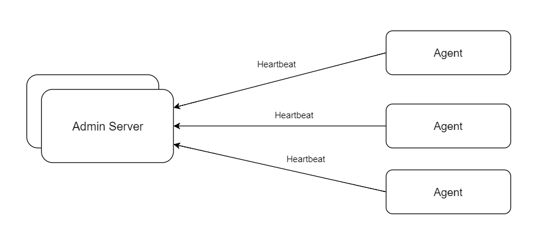
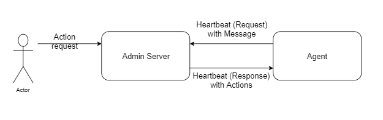

## Heartbeat agent + server demo  

- Agent : guice + jersey + jetty  
- Server : Spring boot + STOMP Websocket

#### Demo  
  


#### Getting started  

```
$git clone

$cd heartbeat

$mvn install -Dmaven.test.skip=true

## Running heartbeat server  

$java -jar heartbeat-server/target/heartbeat-server.jar

## Running heartbeat agent

$java -jar heartbeat-agent/target/heartbeat-agent.jar  

## in browser  
http://localhost:8080/action.html
```  

#### Simple design  

  

  

  